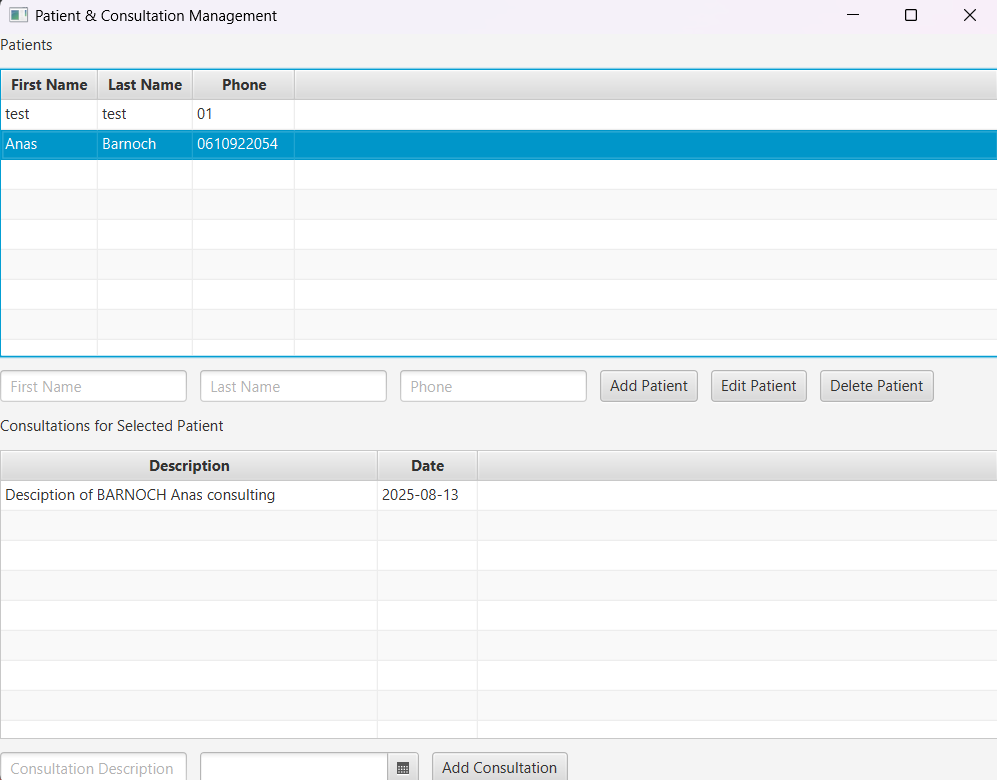

# 🏥 Patient Consulting Management System

A **JavaFX + MySQL** desktop application for managing patients and their medical consultations.  
This system is designed for clinics and small healthcare centers to efficiently store, search, and manage patient records.

---

## ✨ Features
- 📋 **Manage Patients** – Add, edit, delete, and search patient records.
- 💬 **Consultation Tracking** – Record and review consultations for each patient.
- 📂 **Organized DAO** – Clean and maintainable JavaFX code.

---

## 📸 Screenshots

### Application interface


---

## ⚙️ Technologies Used
- **JavaFX** – Graphical User Interface
- **MySQL** – Relational Database
- **JDBC** – Database Connectivity
- **DAO pattern** – Structured Architecture

---

## 🚀 Getting Started

### 1️⃣ Clone the repository
```bash
git clone https://github.com/your-username/patient-consulting-system.git
```

### 2️⃣ Database Setup

Create the database in MySQL:
```
CREATE TABLE ients(   
    id INT PRIMARY KEY AUTO_INCREMENT,
    firstName VARCHAR(30),
    lastName VARCHAR(30),
    phone VARCHAR(20)
);

CREATE TABLE consultations (
    id INT PRIMARY KEY AUTO_INCREMENT,
    date DATE,
    patient_id INT,
    DESCRIPTION TEXT 
    FOREIGN KEY (patient_id) REFERENCES patients(id)
);
```
### 3️⃣ Update Database Credentials
Edit DBConnection.java with your MySQL username and password:
```
private static final String URL = "jdbc:mysql://localhost:3306/patient_consulting_mgmnt";
private static final String USER = "root";
private static final String PASSWORD = "your_password";
```

### 4️⃣ Run the Application

Open the project in your IDE and run the Main.java file.

## 🚀 Technologies
Java (JDK 8+)

JavaFx

Maven ou Gradle pour la gestion de projet


